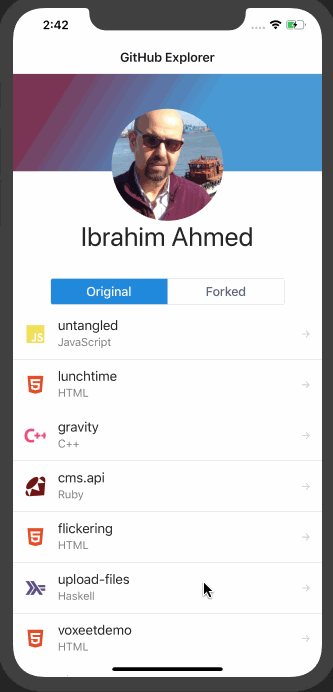

Github Explorer is a demo mobile application built using ReactNative/Expo to connect to Github using Graphql Relay client. it displays:

- The user name/avatar.
- Repositories sources and forks.
- Details page for repository.
- Primary language name and logo.
- List of commits history.

# Technologies and Library:

- ReactNative
- Expo
- Graphql Relay
- React Hooks
- Graphql Queries with Fragments
- React Navigation V5
- Shared Element Animation

## Install
`yarn install`

## Run on IOS or Android
`yarn ios`
`yarn android`

